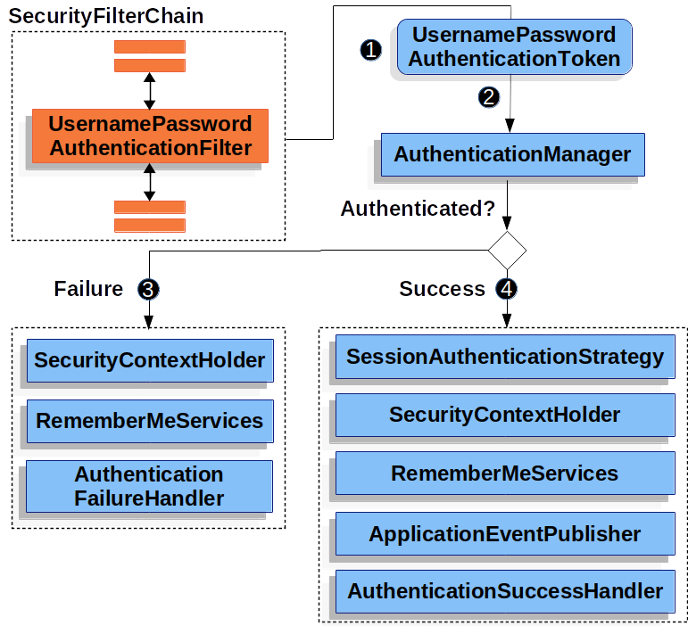

 
 

* SecurtityConfig 설정

  ```java
  @Configuration
  @EnableWebSecurity // 웹보안 활성화를 위한 annotation
  public class SecurityConfig extends WebSecurityConfigurerAdapter {
    @Override
    protected void configure(HttpSecurity http) throws Exception {
        http
            .authorizeRequests()            // 요청에 의한 보안검사 시작
            .anyRequest().authenticated()   // 어떤 요청에도 보안검사를 한다.
        .and()
            .formLogin();                   // 보안 검증은 formLogin방식으로 하겠다.
    }
  }
  ```
  - @EnableWebSecurity annotation을 WebSecurityConfigureAdapter를 상속하는 설정 객체에 붙혀주면 SpringSecurityFilterChain에 등록된다.
    

### AuthenticationFilter 필터 리스트

- WebAsyncManagerInteggrationFilter
- SecurityContextPersistenceFilter
- HeaderWriterFilter
- CsrfFilter
- LogoutFilter
- UsernamePasswordAuthenticationFilter
- RequestCacheAwareFilter
- AnonymouseAuthenticationFilter
  - 이 필터에 올 때까지 앞에서 사용자 정보가 인증되지 않았다면, 이 요청은 익명의 사용자가 보낸 것으로 판단하고 처리한다.  
    (Authentication 객체를 새로 생성함 - AnonymouseAuthenticationToken)
- SessionManagementFilter
  - 세션 변조 공격 방지 (SessionId를 계속 다르게 변경해서 클라이언트에 내려준다)
  - 유효하지 않은 세션으로 접근했을 때 URL 핸들링
  - 하나의 세션 아이디로 접속하는 최대 센션 수(동시 접속) 설정
- ExceptionTranslationFilter
- FilterSecurityInterceptor
  - 인가(Authorization)를 결정하는 AccessDecisionManager에게 접근 권한이 있는지 확인하고 처리하는 필터 

> 스프링시큐리티는 각각 역할에 맞는 필터들이 체인형태로 구성되서 순서에 맞게 실행되는 구조로 동작합니다.  
  사용자는 특정 기능의 필터를 생성하여 등록 할 수 있습니다. 인증을 처리하는 기본필터 UsernamePasswordAuthenticationFilter 대신 별도의 인증 로직을 가진 필터를 생성하고 사용하고 싶을 때 아래와 같이 필터를 등록 하고 사용합니다.
    
  ```java
  @EnableWebSecurity
  public class BrmsWebSecurityConfiguration extends WebSecurityConfigurerAdapter {
    @Override
    public void configure(HttpSecurity http) throws Exception {
        http.addFilterBefore(new CustomAuthenticationProcessingFilter("/login-process"),
                UsernamePasswordAuthenticationFilter.class);
    }
  }
  ```

### Login Form 인증 필터

> UsernamePasswordAuthenticationFilter
 
#### Login Form 인증 로직 플로우

  * 로그인 인증처리를 담당하고 인증처리에 관련된 요청을 처리하는 필터  
    
  UsernamePasswordAuthenticationFilter - Logic

  

  * 인증처리 필터(UsernamePasswordAuthenticationFilter)는 Form인증처리를 하는 필터로써 해당 필터는 크게 두가지로 인증 전과 후의 작업을 관리한다.  
    인증처리전에는 사용자 인증정보를 담아서 전달하면서 인증처리를 맡기고(AuthenticationManager) 성공한 인증객체를 반환받아서 (전역적으로 인증객체를 참조할 수 있도록 설계 된)SecurityContext에 저장하고, 그 이후 SuccessHandler를 통해 인증 성공후의 후속 작업들을 처리합니다.

### LogoutFilter 란

> LogoutFilter
 
  LogoutFilter는 세션 무효화, 인증토큰 삭제, SecurityContext에서 해당 토큰 삭제, 쿠키 삭제 및 로그인 페이지로 리다리렉트를 시켜주는 기능이 있다.

  LogoutFilter의 필터 기능이 구현된 코드
  ```java
  private void doFilter(HttpServletRequest request, HttpServletResponse response, FilterChain chain) throws IOException, ServletException{
  if (this.requiresLogout(request, response)) {
  Authentication auth = SecurityContextHolder.getContext().getAuthentication();
  if (this.logger.isDebugEnabled()) {
  this.logger.debug(LogMessage.format("Logging out [%s]", auth));
  }

            this.handler.logout(request, response, auth);
            this.logoutSuccessHandler.onLogoutSuccess(request, response, auth);
        } else {
            chain.doFilter(request, response);
        }
    }
  ```


